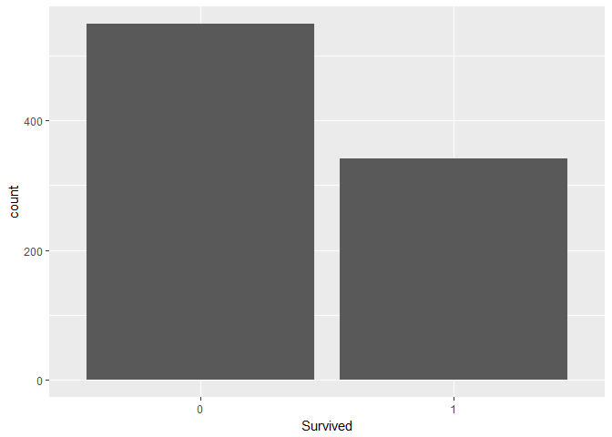
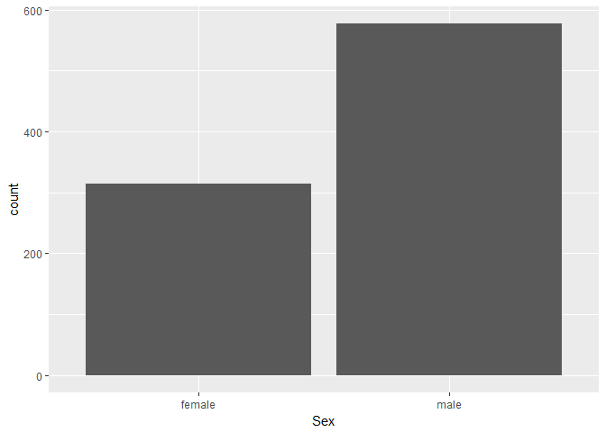
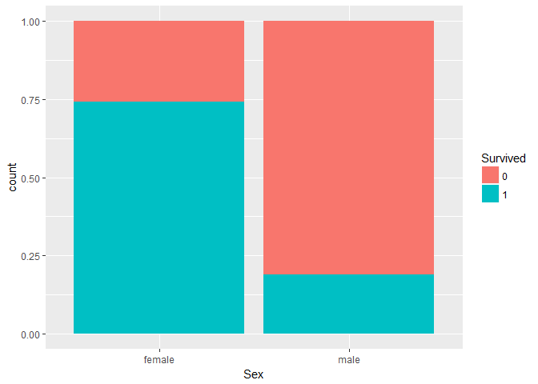

# Titanic Analysis
Jonathan Chiu  
November 10, 2017  


## R Markdown


```r
library(ggplot2)
library(grid)
library(rpart)
library(rattle)
library(rpart.plot)
library(RColorBrewer)
library(randomForest)
library(party)
```

Import the train.csv and test.csv of the titanic dataset


```r
setwd("~/Github/titanic")
train <- read.csv("data/train.csv")
test <- read.csv("data/test.csv")
```


```r
str(train)
```

```
## 'data.frame':	891 obs. of  12 variables:
##  $ PassengerId: int  1 2 3 4 5 6 7 8 9 10 ...
##  $ Survived   : int  0 1 1 1 0 0 0 0 1 1 ...
##  $ Pclass     : int  3 1 3 1 3 3 1 3 3 2 ...
##  $ Name       : Factor w/ 891 levels "Abbing, Mr. Anthony",..: 109 191 358 277 16 559 520 629 417 581 ...
##  $ Sex        : Factor w/ 2 levels "female","male": 2 1 1 1 2 2 2 2 1 1 ...
##  $ Age        : num  22 38 26 35 35 NA 54 2 27 14 ...
##  $ SibSp      : int  1 1 0 1 0 0 0 3 0 1 ...
##  $ Parch      : int  0 0 0 0 0 0 0 1 2 0 ...
##  $ Ticket     : Factor w/ 681 levels "110152","110413",..: 524 597 670 50 473 276 86 396 345 133 ...
##  $ Fare       : num  7.25 71.28 7.92 53.1 8.05 ...
##  $ Cabin      : Factor w/ 148 levels "","A10","A14",..: 1 83 1 57 1 1 131 1 1 1 ...
##  $ Embarked   : Factor w/ 4 levels "","C","Q","S": 4 2 4 4 4 3 4 4 4 2 ...
```


```r
train$Survived = as.factor(train$Survived)
train$Sex = as.factor(train$Sex)
```


Survived category has "0" to represent "Not Survived", and "1" to represent "Survived."


```r
table(train$Survived)
```

```
## 
##   0   1 
## 549 342
```

```r
prop.table(table(train$Survived))
```

```
## 
##         0         1 
## 0.6161616 0.3838384
```

```r
ggplot(aes(x=Survived), data = train) + geom_bar()
```

<!-- -->


```r
table(train$Sex)
```

```
## 
## female   male 
##    314    577
```

```r
ggplot(aes(x=Sex), data = train) + geom_bar()
```

<!-- -->


```r
ggplot(aes(x=Sex, fill=Survived), data = train) + geom_bar(position="fill")
```

<!-- -->

